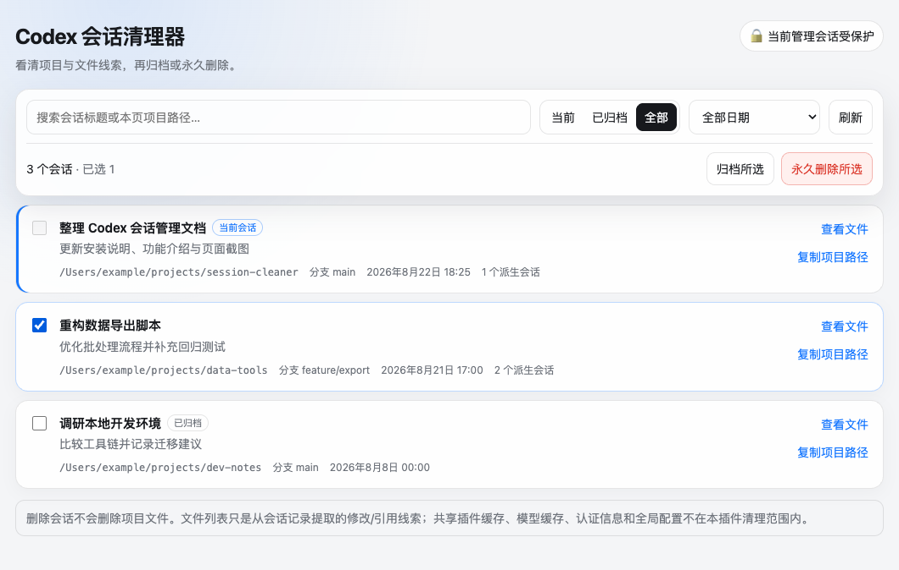

# Codex 会话清理器

本地 Codex 会话管理插件。通过 MCP Apps 管理页和 Codex `app-server` 提供会话检索、文件线索查看、批量归档与永久删除功能。



## 功能

- 浏览当前、已归档或全部顶层会话，并统计各会话的派生会话数量；
- 按标题或项目路径搜索会话；
- 按最后更新时间筛选 3 个月前、1 个月前、1 周前的会话，或使用自定义日期范围；
- 显示项目目录、Git 分支、会话状态和最后更新时间；
- 从会话记录中提取“修改文件”和“命令引用文件”线索，并支持复制路径；
- 批量归档所选会话；
- 输入确认词 `永久删除` 后，批量删除所选会话及其派生会话；
- 删除成功后同步 Codex 桌面侧边栏，避免保留无法打开的历史条目；
- 禁止删除当前管理会话和临时会话。

## 运行要求

- Codex CLI，且终端可执行 `codex`；
- Python 3；
- ChatGPT 桌面端 Codex，用于显示可视化管理页。

服务器仅使用 Python 标准库。Codex 插件支持从 ChatGPT 桌面端或 Codex CLI 安装，IDE 扩展暂不支持插件。参见 [OpenAI 插件文档](https://learn.chatgpt.com/docs/plugins)。

`codex` 不在默认 `PATH` 时，通过 `CODEX_CLI_PATH` 指定路径；非默认数据目录通过 `CODEX_HOME` 指定。

## 安装

本项目须通过 Codex marketplace 安装。marketplace 来源支持本地目录、Git 仓库及 HTTPS/SSH Git 地址。

### 1. 注册远程 marketplace

```bash
codex plugin marketplace add travisoa/codex-plugins --ref main
```

### 2. 安装插件

```bash
codex plugin add codex-session-cleaner@codex-plugins
```

验证安装状态：

```bash
codex plugin list
```

列表中应显示 `codex-session-cleaner@codex-plugins` 的状态为 `installed, enabled`，来源为 Git marketplace。安装后新建 Codex 任务以加载技能和 MCP 工具。

也可在 Codex CLI 中输入 `/plugins`，从已配置的 marketplace 中安装插件。

## 使用

在新建的 Codex 任务中使用以下指令触发插件：

- `打开 Codex 会话管理页`
- `查看本地 Codex 会话及其项目路径`
- `清理 Codex 历史会话`

页面操作流程：

1. 使用搜索框、状态切换和日期条件缩小会话范围；
2. 点击“查看文件”，核对从该会话记录提取的修改/引用文件线索；
3. 勾选目标会话；当前管理会话和临时会话不可选；
4. 点击“归档所选”归档会话；
5. 点击“永久删除所选”，输入确认词 `永久删除`；
6. 删除成功后，插件会刷新列表并同步桌面侧边栏。

侧边栏同步失败时，刷新或重启 Codex；已删除会话不得重复提交。

## 提供的工具

| 工具 | 用途 |
| --- | --- |
| `open_session_manager` | 读取会话并打开可视化管理页 |
| `list_sessions` | 按状态、搜索词和最后更新时间列出会话 |
| `inspect_session_files` | 提取指定会话的修改文件和命令引用文件线索 |
| `archive_sessions` | 批量归档所选顶层会话 |
| `delete_sessions` | 在确认词与当前会话保护校验通过后永久删除会话 |

## 安全边界

- 永久删除通过 Codex `thread/delete` 执行，删除所选持久化会话及其派生会话，且不可撤销；
- 插件不会删除项目文件；页面中的文件列表只是从会话记录提取的线索，不代表项目的完整文件集合；
- 删除成功后，插件仅按已删除的会话 ID 清理桌面本地目录项，并通过桌面 IPC 刷新窗口；
- 桌面数据结构不兼容时停止侧边栏同步，不影响已完成的会话删除；
- 当前管理会话和临时会话不可删除；
- 后端校验确认词、当前会话元数据及非空会话 ID；
- 插件不会清理跨会话共享的插件缓存、模型缓存、认证信息或全局配置。

## 卸载

```bash
codex plugin remove codex-session-cleaner@codex-plugins
```

## 本地开发

本地调试时，可将仓库目录直接注册为 marketplace：

```bash
codex plugin marketplace add /path/to/codex-plugins
codex plugin add codex-session-cleaner@codex-plugins
```

测试与语法检查：

```bash
python3 -m unittest discover -s tests -v
python3 -m compileall server tests
```

启动 MCP 服务器：

```bash
./scripts/launch_server.sh
```

服务器使用逐行 JSON-RPC（stdio）。正常运行时由 Codex 根据 [`.mcp.json`](.mcp.json) 自动启动。

## 项目结构

```text
.codex-plugin/plugin.json  插件清单与默认触发语句
.mcp.json                  MCP 服务器启动配置
skills/session-manager/    会话管理技能说明
server/server.py           MCP 与 Codex app-server 适配层
web/manager.html           自包含的 MCP Apps 管理页
tests/test_server.py       后端与页面契约测试
```

## 许可证

[MIT](../../LICENSE)
