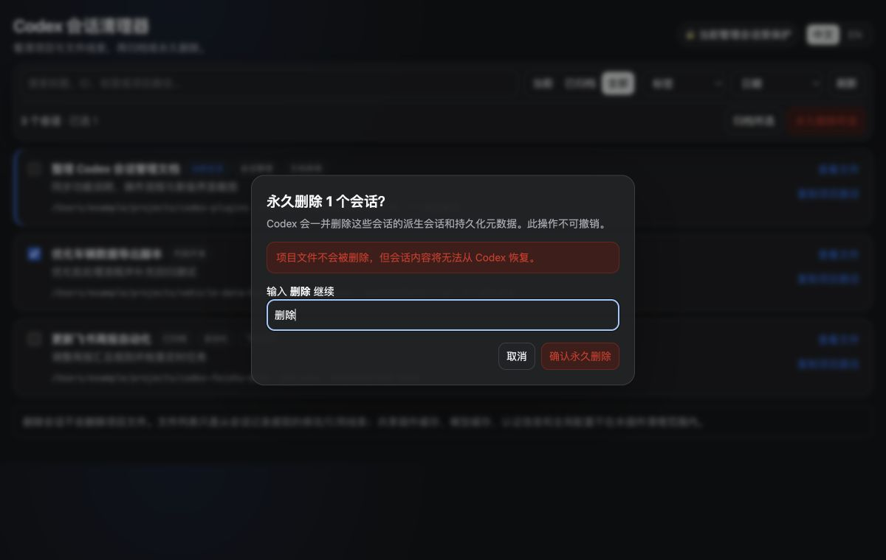

# Codex 会话清理器

本地 Codex 会话管理插件。通过 MCP Apps 管理页、终端界面（TUI）和 Codex `app-server` 集中查看当前及已归档会话，按状态、类别标签和日期筛选，核对项目与文件线索，并安全地批量归档或永久删除会话。


## 功能

- 浏览当前、已归档或全部顶层会话，并统计各会话的派生会话数量；同时显示被 Codex 常规列表隐藏、但仍会阻止源会话删除的空分叉；
- 按标题、会话 ID、类别标签或项目路径搜索会话；
- 自动添加“会话管理、自动化、插件开发、飞书协作、文档表格、图像视频、代码开发、常规任务、隐藏分叉”等类别标签，并支持按标签筛选；
- 分类优先使用标题和清洗后的会话预览，忽略 `plugin://` 调用标记；仅在内容没有明确类别时才使用项目路径作为补充依据；
- 按最后更新时间筛选 1 天内、1 周内、1 个月内，以及 3 个月前、1 个月前、1 周前的会话，或使用自定义日期范围；
- 显示项目目录、Git 分支、会话状态和最后更新时间；
- 从会话记录中提取“修改文件”和“命令引用文件”线索，并支持复制路径；
- 批量归档所选会话；
- 中文界面输入确认词 `删除`（英文界面输入 `delete`）后，批量删除所选会话及其派生会话；同批选择存在历史引用关系的分叉和源会话时，插件会先删除分叉；
- 管理页根据 Codex Host 语言自动显示中文或英文，Host 未提供语言时回退到浏览器语言；也可使用标题栏中“当前管理会话受保护”旁的“中文 / EN”按钮手动切换，手动选择在当前页面内优先；
- 删除成功后同步 Codex 桌面侧边栏，避免保留无法打开的历史条目；
- `open_session_manager` 始终只列出会话并返回管理页组件，不会自行弹出表单；在渲染不了管理页但支持交互表单的客户端（如 Codex CLI）上，可调用 `select_sessions` 进入三步交互：筛选（范围 / 最后更新时间 / 类别标签）→ 从编号列表中输入序号多选 → 选择归档、永久删除或取消，全部在表单中完成；
- 同类客户端上，永久删除前由插件弹出勾选表单，逐条列出会话标题、完整项目路径与更新时间，只删除用户勾选的会话；用户取消、未勾选或表单发送失败时一律不删；
- 根据 MCP `initialize` 握手判断客户端能否渲染组件：支持时返回可视化管理页，不支持时返回同等信息的文本会话列表（含会话 ID、项目、标签、状态与阻塞分叉），并提示可改用终端界面；
- 禁止删除当前管理会话和临时会话；
- 提供纯终端界面（TUI），在 Codex CLI 环境下用键盘完成同样的浏览、筛选、文件线索查看、归档与删除，并复用与管理页完全相同的后端安全规则。

## 运行要求

- Codex CLI，且终端可执行 `codex`；
- Python 3；
- ChatGPT 桌面端 Codex，用于显示可视化管理页；终端界面（TUI）不需要桌面端，只需支持 curses 的终端。

服务器仅使用 Python 标准库。Codex 插件支持从 ChatGPT 桌面端或 Codex CLI 安装，IDE 扩展暂不支持插件。参见 [OpenAI 插件文档](https://learn.chatgpt.com/docs/plugins)。

`codex` 不在默认 `PATH` 时，通过 `CODEX_CLI_PATH` 指定路径；非默认数据目录通过 `CODEX_HOME` 指定。

## 安装

本项目须通过 Codex marketplace 安装。marketplace 来源支持本地目录、Git 仓库及 HTTPS/SSH Git 地址。

### 1. 注册远程 marketplace

```bash
codex plugin marketplace add travisoa/codex-plugins --ref main
```

### 2. 安装插件

```bash
codex plugin add codex-session-cleaner@codex-plugins
```

验证安装状态：

```bash
codex plugin list
```

列表中应显示 `codex-session-cleaner@codex-plugins` 的状态为 `installed, enabled`，来源为 Git marketplace。安装后新建 Codex 任务以加载技能和 MCP 工具。

也可在 Codex CLI 中输入 `/plugins`，从已配置的 marketplace 中安装插件。

## 使用

### 打开管理页

在新建的 Codex 任务中使用以下指令触发插件：

- `打开 Codex 会话管理页`
- `查看本地 Codex 会话及其项目路径`
- `清理 Codex 历史会话`

插件会在 Codex 中打开管理页。标题栏右侧显示当前管理会话的保护状态，并在同一区域提供“中文 / EN”切换按钮。

### 筛选与核对

1. 使用“当前 / 已归档 / 全部”切换会话状态范围；
2. 在搜索框中输入标题、会话 ID、类别标签或项目路径；
3. 使用“标签”筛选会话类别；使用“日期”筛选 1 天内、1 周内、1 个月内或更早的会话，也可以指定自定义起止日期；
4. 核对会话卡片中的状态、类别标签、项目目录、Git 分支、最后更新时间和派生会话数量；
5. 点击“查看文件”，检查从会话记录提取的修改文件和命令引用文件线索；需要在终端中定位项目时可点击“复制项目路径”。

列表默认展示顶层会话。子代理、审查及其他普通派生会话随所属顶层会话处理，不单独显示；会阻止删除的隐藏空分叉会作为“隐藏分叉”单独显示。

### 归档或永久删除

1. 勾选目标会话；当前管理会话和临时会话受保护，不能选择；
2. 点击“归档所选”，将会话移入 Codex 已归档列表；
3. 点击“永久删除所选”，在中文界面输入 `删除`，英文界面输入 `delete`，再确认永久删除；
4. 插件会删除所选会话及其派生会话和持久化元数据，但不会删除项目文件；
5. 删除成功后，管理页自动刷新会话列表，并同步 Codex 桌面侧边栏。



### 在终端中使用（TUI）

不打开桌面端时，可直接运行插件自带的终端界面：

```bash
./scripts/launch_tui.sh
```

从 marketplace 安装后，脚本位于插件安装目录下，例如：

```bash
~/.codex/plugins/cache/codex-plugins/codex-session-cleaner/*/scripts/launch_tui.sh
```

界面语言默认跟随 `LANG` 等环境变量，可用 `--lang zh` 或 `--lang en` 指定。

按键：

| 按键 | 作用 |
| --- | --- |
| `↑` `↓` / `k` `j` | 移动光标，`PgUp` `PgDn` 翻页 |
| `空格` | 勾选或取消当前会话；受保护的会话不可勾选 |
| `/` | 搜索标题、ID、标签或项目路径 |
| `F` | 打开筛选面板，调整状态范围、类别标签和最后更新时间 |
| `I` | 查看当前会话的修改文件与命令引用文件线索 |
| `A` | 归档所选会话 |
| `D` | 永久删除所选会话，需输入确认词 |
| `R` | 刷新 |
| `Q` | 退出 |

终端界面直接复用 `server.py` 的列表、归档与删除实现，因此当前会话保护、临时会话保护、确认词校验、隐藏分叉阻塞和桌面侧边栏同步的行为与管理页完全一致。

通过 MCP 工具调用插件时（无论在 Codex CLI 还是桌面端），Codex 都会在调用元数据中提供当前会话 ID，当前会话保护始终生效。而独立运行本脚本时，进程本身不属于任何 Codex 会话，默认没有“当前会话”可保护，此时列表中的顶层会话均可删除，界面右上角会显示“CLI 模式 · 未绑定当前会话”。若终端中另有正在运行的 Codex 会话需要保护，用 `--current` 显式指定：

```bash
./scripts/launch_tui.sh --current <thread-id>
```

指定后该会话在界面中标记为“当前”，且无法被勾选、归档或删除。

### 删除启动会话管理页的任务

若删除用于启动会话管理页的任务失败，先在 Codex 侧边栏将该任务归档；随后新建或切换到另一个任务，重新打开会话管理页，在“已归档”或“全部”中选择原任务并执行永久删除。不要在原任务打开的管理页中删除该任务自身。

### 删除被隐藏分叉引用的任务

若源任务显示“引用分叉阻止源会话删除”，先筛选“隐藏分叉”标签，勾选对应分叉后删除，再删除源任务；也可以同时勾选分叉与源任务，插件会按“分叉在前、源任务在后”的安全顺序执行。仅归档分叉或源任务不会解除历史引用。

侧边栏同步失败时，刷新或重启 Codex；已删除会话不得重复提交。

## 提供的工具

| 工具 | 用途 |
| --- | --- |
| `open_session_manager` | 读取会话并打开可视化管理页 |
| `select_sessions` | 在支持交互表单的命令行客户端中引导用户筛选、选择并归档或删除会话 |
| `list_sessions` | 按状态、搜索词、类别标签和最后更新时间列出会话，并补充隐藏分叉 |
| `inspect_session_files` | 提取指定会话的修改文件和命令引用文件线索 |
| `archive_sessions` | 批量归档所选顶层会话 |
| `delete_sessions` | 在确认词与当前会话保护校验通过后永久删除会话 |

终端界面不是 MCP 工具，由用户在终端中直接运行，不经过模型调用。

在不能渲染 MCP Apps 组件的客户端（例如 Codex CLI）中，`open_session_manager` 和 `list_sessions` 会返回
结构化的文本会话列表而不是管理页，`inspect_session_files`、`archive_sessions` 和 `delete_sessions`
也会返回逐条的文本结果，因此这些工具在纯命令行环境下同样可用。

此类客户端若同时支持 MCP `elicitation`（Codex CLI 即是），文本列表末尾会提示可以调用 `select_sessions`
进入交互式操作。该工具弹出三步表单：

1. **筛选**：会话范围、最后更新时间、类别标签（标签选项按实际会话数量生成）；
2. **选择**：把筛选结果按每页 10 个编号列出，用一个输入框收多选结果，支持 `1,3`、`5-7`、`all`，`clear` 清空重选；
   结果超过一页时另有“完成选择 / 下一页 / 上一页”选项字段，序号在整个结果集中始终有效，
   已选中的会话会在列表中标为 `✓` 并汇总显示，可以边翻页边累加，最后选“完成选择”提交；
3. **操作**：取消、归档所选、永久删除所选，默认取消。

列表与管理页依据同一份数据：子代理、审查等普通派生会话同样不单独列出，但会以“连带 N 个派生会话”
标明删除的影响范围；隐藏分叉、已归档、临时会话和被分叉引用的会话都会标注出来。
当前会话和其他受保护会话标为 `⊘`，仍然可见但不能被选中，
误选时会指出具体序号并要求重新输入；`all` 表示全选当前筛选下可操作的会话，会自动跳过受保护项。
序号无法识别或超出范围时同样不会中止流程，而是在同一张表单里提示原因并重新输入，不会猜测用户意图。
无论筛选到多少会话都不会被拒绝，页码会如实显示总页数（例如“第 1/17 页”），由用户自行决定是继续翻页还是缩小筛选。
取消筛选会退回普通文本列表。

由于会话与操作都已由用户在表单中敲定，该路径下的删除不再重复弹出确认表单；单次仍最多处理 100 个会话，
与 `delete_sessions` 的批量上限一致。

交互流程只在显式调用 `select_sessions` 时发生。插件不会根据客户端握手去猜测该弹表单还是该显示管理页——
能渲染管理页的客户端（如 ChatGPT 桌面端）调用 `open_session_manager` 始终直接得到管理页。

Codex CLI 的 elicitation 表单只支持字符串、数字、整数和布尔四种基本类型，没有数组类型，
因此无法呈现原生的列表多选控件；编号输入是该限制下一次选中多个会话的方式。

`delete_sessions` 会在执行前弹出勾选表单：
逐条显示会话标题、完整项目路径和更新时间，默认全部不勾选，只有被选为 `True` 的会话才会删除。
选中会话超过 8 个时改为一次性整体确认，避免逐字段确认过长。取消、未勾选或表单发送失败都不会删除任何会话。
已经提供管理页勾选的客户端（如 ChatGPT 桌面端）不会重复弹出该表单。

## 安全边界

- 永久删除通过 Codex `thread/delete` 执行，删除所选持久化会话及其派生会话，且不可撤销；
- 插件不会删除项目文件；页面中的文件列表只是从会话记录提取的线索，不代表项目的完整文件集合；
- 删除成功后，插件仅按已删除的会话 ID 清理桌面本地目录项，并通过桌面 IPC 刷新窗口；
- 桌面数据结构不兼容时停止侧边栏同步，不影响已完成的会话删除；
- 当前管理会话和临时会话不可删除；归档同样只接受列表中的顶层会话，拒绝派生会话、临时会话和已不存在的 ID；
- 源会话仍被未选择的历史分叉引用时停止删除，并返回阻塞分叉 ID；
- 同批选中的分叉删除失败时，源会话一并停止删除，避免留下悬空引用；
- 管理页使用短期、不可伪造的上下文令牌维持当前会话保护；令牌失效后必须重新打开管理页；
- 后端校验确认词、管理页上下文及非空会话 ID；
- 终端界面复用同一套后端校验，不额外放宽任何限制；CLI 未绑定当前会话时没有“当前会话”可保护，需要保护时用 `--current` 指定；
- 插件不会清理跨会话共享的插件缓存、模型缓存、认证信息或全局配置。

## 卸载

```bash
codex plugin remove codex-session-cleaner@codex-plugins
```

## 本地开发

本地调试时，可将仓库目录直接注册为 marketplace：

```bash
codex plugin marketplace add /path/to/codex-plugins
codex plugin add codex-session-cleaner@codex-plugins
```

测试与语法检查：

```bash
python3 -m unittest discover -s tests -v
python3 -m compileall server tui tests
```

启动 MCP 服务器：

```bash
./scripts/launch_server.sh
```

服务器使用逐行 JSON-RPC（stdio）。正常运行时由 Codex 根据 [`.mcp.json`](.mcp.json) 自动启动。

## 项目结构

```text
.codex-plugin/plugin.json  插件清单与默认触发语句
.mcp.json                  MCP 服务器启动配置
skills/session-manager/    会话管理技能说明
server/server.py           MCP 与 Codex app-server 适配层
web/manager.html           自包含的 MCP Apps 管理页
tui/session_tui.py         纯标准库 curses 终端界面
scripts/launch_tui.sh      终端界面启动脚本
assets/screenshots/        README 使用的管理页与删除确认截图
tests/test_server.py       后端与页面契约测试
tests/test_tui.py          终端界面状态、宽度与渲染测试
```

## 许可证

[MIT](../../LICENSE)
